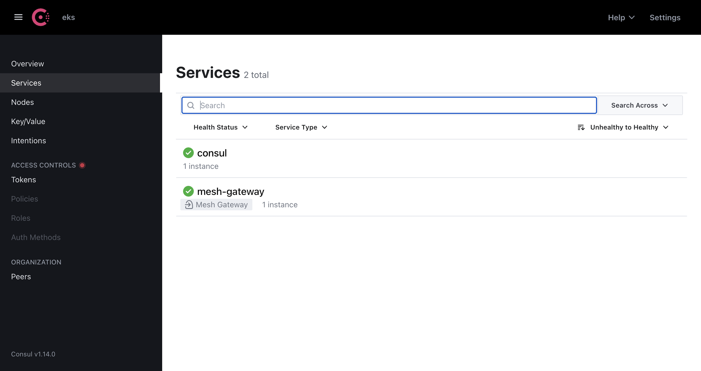
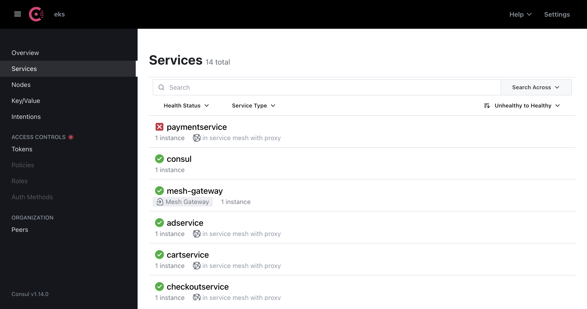
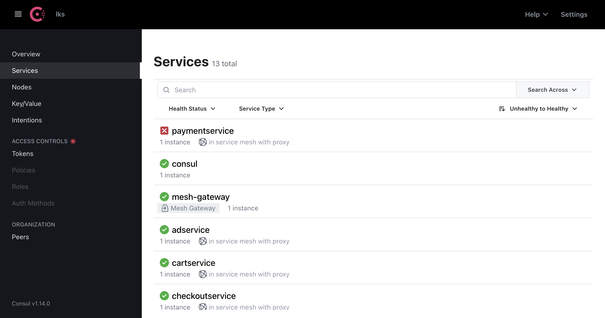
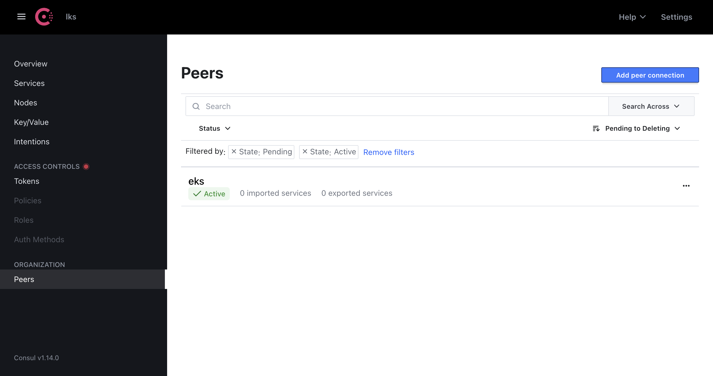
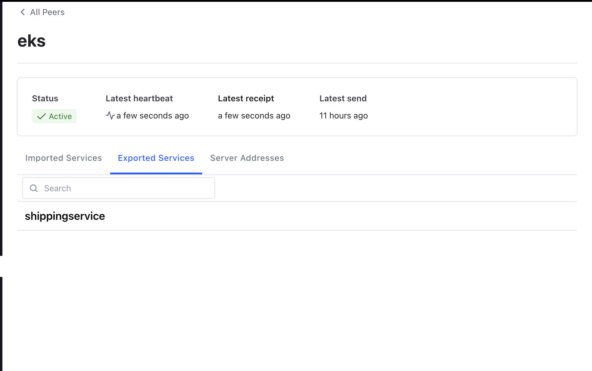
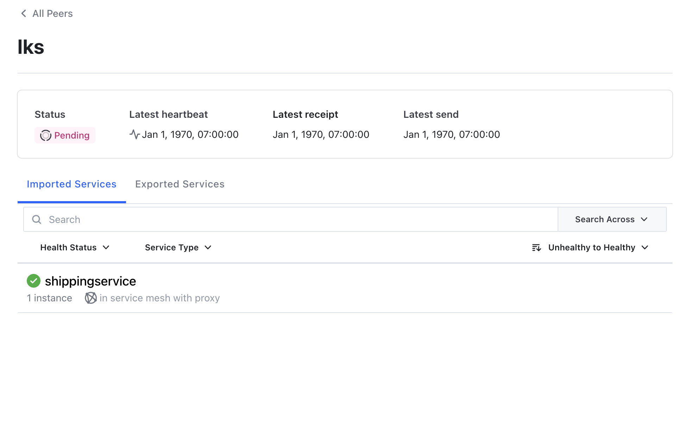

# Consul Multi-Cluster Service Mesh with Failover

A demo project that sets up a Consul service mesh across two Kubernetes clusters (AWS EKS and Linode) with automatic service failover between them.

---

## Prerequisites

Before starting, make sure you have the following:

- An AWS account with valid credentials
- A Linode account with an existing Kubernetes cluster
- The following CLI tools installed: `terraform`, `kubectl`, `helm`, and `aws`

---

## Setup Guide

### Step 1: Create AWS EKS Cluster

```bash
cd terraform

# Create a tfvars file with your AWS credentials
cat > terraform.tfvars <<EOF
aws_access_key_id     = "your-key"
aws_secret_access_key = "your-secret"
aws_region            = "us-east-1"
EOF

# Initialize and deploy infrastructure
terraform init -upgrade
terraform apply -var-file terraform.tfvars
```

---

### Step 2: Connect to EKS Cluster

```bash
aws configure
aws eks update-kubeconfig --region us-east-1 --name myapp-eks-cluster

# Verify the connection
kubectl get svc
```

---

### Step 3: Deploy Microservices on EKS

```bash
cd ../kubernetes

# Deploy applications
kubectl apply -f config-consul.yaml

# Verify pods are running
kubectl get pod
```

---

### Step 4: Install Consul on EKS

```bash
# Add the HashiCorp Helm repo
helm repo add hashicorp https://helm.releases.hashicorp.com
helm repo update

# Install Consul on the EKS cluster
helm install eks hashicorp/consul --version 1.0.0 \
  --values consul-values.yaml \
  --set global.datacenter=eks

# Verify all pods are running
kubectl get pod

# Get the Consul UI external URL
kubectl get svc -l app=consul,component=ui
# Open the EXTERNAL-IP in your browser (accept the self-signed certificate)
```

---

### Step 5: Inject Consul Sidecars

```bash
# Restart deployments to trigger sidecar injection
kubectl rollout restart deployment -l app!=consul

# Verify all pods are ready
kubectl get pod
```

---

### Step 6: Configure Linode Cluster

```bash
# Merge kubeconfigs
export KUBECONFIG=~/.kube/config:/path/to/linode/kubeconfig.yaml

# List available contexts and switch to Linode
kubectl config get-contexts
kubectl config use-context <linode-context>

# Install Consul on the Linode cluster
helm install lks hashicorp/consul --version 1.0.0 \
  --values consul-values.yaml \
  --set global.datacenter=lks

# Deploy microservices
kubectl apply -f config-consul.yaml

# Restart deployments for sidecar injection
kubectl rollout restart deployment -l app!=consul

# Get the Consul UI URL
kubectl get svc -l app=consul,component=ui
```

---

### Step 7: Set Up Consul Peering

1. **On the EKS Consul UI (AWS):**
   - Navigate to **Peers**
   - Click **Add peer connection**
   - Click **Generate token** and copy it

2. **On the Linode Consul UI:**
   - Navigate to **Peers**
   - Click **Establish peering**
   - Paste the token and name the peer **`eks`**
   - Wait for the status to change to **Active**

---

### Step 8: Configure Service Failover

```bash
# Apply service resolver on EKS
kubectl config use-context <aws-context>
kubectl apply -f service-resolver.yaml

# Export services from Linode
kubectl config use-context <linode-context>
kubectl apply -f exported-service.yaml

# Confirm peering shows imported/exported services in the Consul UI under the Peers tab
```

---

### Step 9: Test Failover

```bash
# Simulate a failure by deleting a service from EKS
kubectl delete deployment shippingservice

# Traffic should automatically reroute to the Linode cluster
# The application should continue working without interruption
```

---

## Commands Reference

```bash
# Consul peering
consul peering list
consul peering read <peer-name>

# Switch between clusters
kubectl config use-context <context-name>
kubectl config current-context
kubectl config get-contexts

# Inspect resources
kubectl get pod
kubectl get svc
kubectl get mesh

# Consul UI
kubectl get svc -l app=consul,component=ui
```

---

## Cleanup

```bash
# Destroy AWS infrastructure
cd terraform
terraform destroy -var-file terraform.tfvars

# Delete the Linode cluster from the Linode dashboard
```

---

## Troubleshooting

**Pods in `CrashLoopBackOff`**
- Check logs: `kubectl logs <pod-name>`
- Note: `paymentservice` may crash due to Google Cloud Profiler — this is expected behavior.

**Peering not connecting**
- Confirm both Consul servers are running: `kubectl get pod -l app=consul`
- Check server logs: `kubectl logs -l app=consul,component=server`
- Verify that external IPs are reachable between the two clusters.

**Storage issues**
- The EBS storage class must be type `gp3`, not `gp2`.
- Verify with: `kubectl get storageclass`

---

## Evidence of Work

### Cluster Setup


Consul Services dashboard on the EKS cluster showing 2 healthy services.





---

### Peer Connection


Linode Consul (lks) peers page showing the initial pending connection to the "eks" cluster.


AWS Consul (eks) peers page showing an active peering connection with the "lks" cluster.

---

### Configure Failover


EKS peer details — Status: Active. Exported service: `shippingservice` (available for Linode to import).


LKS peer details — Imported service: `shippingservice` from eks (1 instance in the service mesh with proxy). Demonstrates the failover setup — if the EKS `shippingservice` fails, requests are rerouted to Linode.

---

## References

- [Consul Crash Course – GitLab](https://gitlab.com/twn-youtube/consul-crash-course)
- [Consul Crash Course – YouTube](https://www.youtube.com/watch?v=s3I1kKKfjtQ)